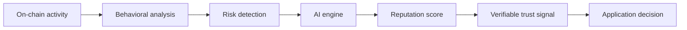
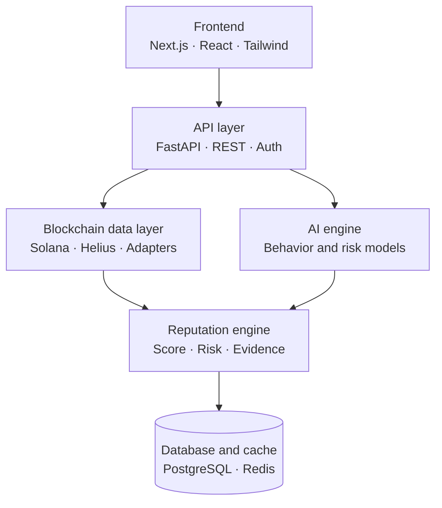
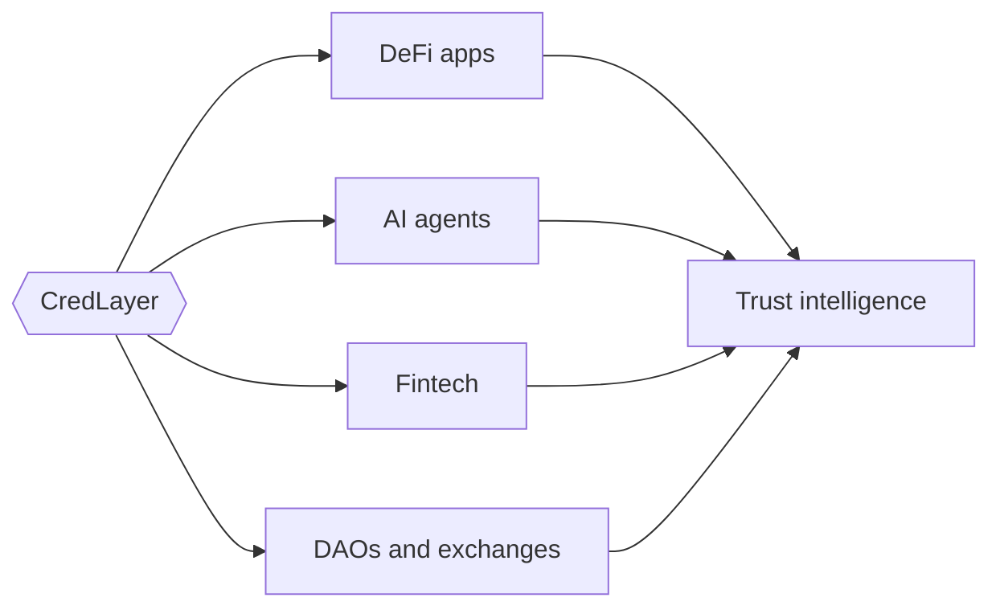
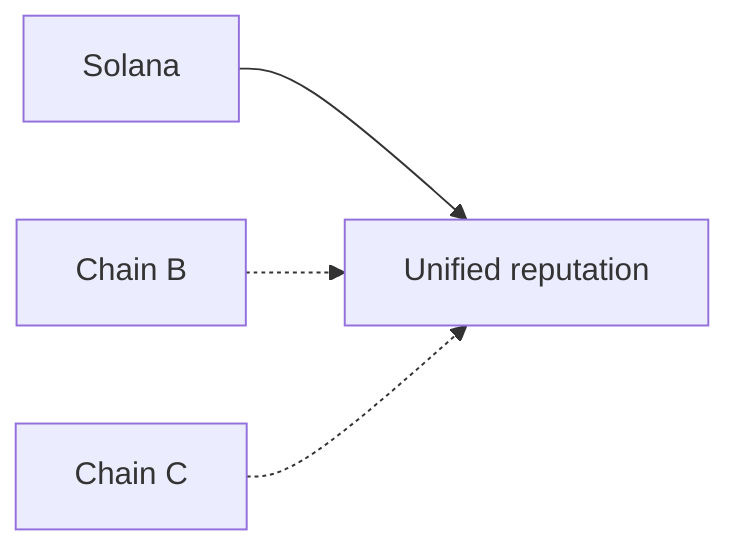
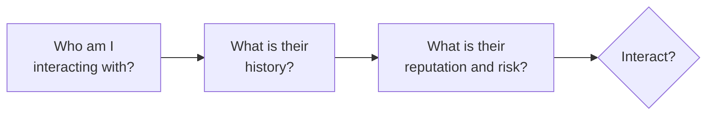

<div align="center">

# CredLayer

**Trust, risk, and reputation infrastructure for Web3**

*Trust the behavior. Verify the reputation. Secure the interaction.*


</div>

<p align="center">
  
</p>

---

## Overview

CredLayer is a B2B infrastructure platform that analyzes on-chain activity, wallet behavior, and transaction patterns to produce explainable reputation and risk assessments.

Instead of asking *"Who is this wallet?"*, CredLayer helps applications ask:

> **"Can I trust this wallet, and what evidence supports that decision?"**

**Built for:** DeFi protocols · lending platforms · DAOs · exchanges · fintech apps · AI-agent platforms · developers building trust-aware applications.

---

## Table of contents

- [The problem](#the-problem)
- [How it works](#how-it-works)
- [Core features](#core-features)
- [Architecture](#architecture)
- [Developer platform](#developer-platform)
- [AI agent trust](#ai-agent-trust)
- [Tech stack](#tech-stack)
- [Security model](#security-model)
- [Project structure](#project-structure)
- [Getting started](#getting-started)
- [Roadmap](#roadmap)
- [Contributing](#contributing)
- [License](#license)

---

## The problem

Web3 is permissionless, which creates a trust gap. A wallet address alone doesn't tell an application:

- Whether the wallet behaves responsibly
- Whether it has interacted with risky contracts
- Whether its transaction patterns are suspicious
- Whether its on-chain history is consistent
- Whether an AI agent should trust it
- Whether a protocol should extend credit to it

Most apps rely on a thin pipeline of transaction history and basic rules. CredLayer adds an intelligence layer on top.

---

## How it works



---

## Core features

### Wallet reputation
Reputation intelligence derived from wallet behavior: transaction history, wallet age, activity frequency, contract interactions, asset activity, and behavioral consistency.

### AI-powered risk analysis
Pattern recognition that goes beyond rule-based systems to surface suspicious behavior, unusual transaction activity, risky interactions, anomalies, and potential fraud indicators.

### Explainable reputation scoring
Complex behavior is distilled into a simple score, backed by the signals that produced it.

```text
CredLayer Reputation
Score: 842 / 1000

Trust level           ██████████████████░░  84%
Risk level            ████░░░░░░░░░░░░░░░░  18%
Behavior consistency  ████████████████░░░░  82%
```

The scoring system is designed to become portable across applications and ecosystems.

---

## Architecture

CredLayer is infrastructure, not another analytics dashboard. Applications integrate it directly through APIs and SDKs.



**Where it plugs in**



**Multi-chain direction.** CredLayer launches on Solana, with an adapter-based design for unified cross-chain reputation later.



---

## Developer platform

CredLayer is designed with developers as first-class users: integrate reputation intelligence without building your own blockchain analytics stack.

**Planned capabilities:** Reputation API · Wallet analysis API · Risk analysis API · Developer dashboard · API keys · Usage monitoring · SDKs · Webhooks · Docs · Multi-chain adapters

### Example response

```http
GET /api/v1/reputation/{wallet}
```

```json
{
  "wallet": "7xK...9LmP",
  "reputationScore": 842,
  "riskLevel": "low",
  "confidence": 0.91,
  "network": "solana"
}
```

### SDK usage (planned)

**JavaScript / TypeScript**

```ts
const reputation = await credlayer.wallet.analyze({
  address: walletAddress,
  chain: "solana",
});

console.log(reputation.score);
```

**Python**

```python
result = credlayer.wallet.analyze(
    address=wallet_address,
    chain="solana",
)

print(result["score"])
```

**REST**

```bash
curl https://api.credlayer.xyz/v1/reputation/WALLET_ADDRESS
```

> The SDK and public API are on the roadmap and not yet released.

---

## AI agent trust

As autonomous agents start transacting with wallets, protocols, marketplaces, and each other, they need reliable trust signals. CredLayer gives agents a way to decide whether to interact:



---

## Reputation model

The engine combines multiple behavioral signal groups, then applies AI analysis to produce the final score. Scores stay explainable: every result comes with its supporting signals.

| Signal group | Examples |
|---|---|
| Transaction behavior | Frequency, volume patterns, counterparties |
| Wallet history | Age, consistency, asset activity |
| Risk signals | Risky contracts, anomalies, fraud indicators |

---

## Target customers

| Segment | Examples |
|---|---|
| DeFi | Lending, borrowing, DEXs, credit protocols |
| Web3 | Wallets, DAOs, marketplaces, infrastructure providers |
| AI | Autonomous agents, agent marketplaces, AI-to-AI transactions |
| Fintech | Digital financial platforms, blockchain-enabled fintech, credit infrastructure |

---

## Tech stack

| Layer | Technologies |
|---|---|
| Frontend | Next.js, React, TypeScript, Tailwind CSS, Framer Motion |
| Backend | Python, FastAPI, PostgreSQL (Supabase), Alembic, Redis |
| AI | Python, ML models, behavioral analysis, risk classification |
| Blockchain | Solana, Rust, Solana programs, Helius |
| Infrastructure | Docker, GitHub Actions, Vercel, Railway, Cloudflare |

---

## Security model

CredLayer is a **non-custodial** infrastructure layer. It never requires:

- ❌ Private keys
- ❌ Seed phrases
- ❌ Wallet custody
- ❌ Unauthorized transactions

It works from public wallet addresses and blockchain data only. Wallet signatures are requested solely when a feature genuinely needs proof of wallet ownership.

### Development principles

| Principle | Meaning |
|---|---|
| Security first | Assets and private keys are never exposed to CredLayer |
| Explainable intelligence | Scores are backed by understandable signals |
| Privacy | Only necessary information is processed |
| Verifiability | Important reputation claims can be independently verified |
| Developer first | Integration is simple, with no infrastructure rebuild |
| Modular architecture | Blockchain, AI, reputation, and API layers extend independently |

---

## Project structure

```text
credlayer/
├── Frontend/          # Next.js app and developer dashboard
├── Backend/           # FastAPI service, models, migrations
├── ai/                # Models, pipelines, analysis, scoring
├── blockchain/        # Solana programs, clients, SDK, integrations
├── sdk/               # JavaScript and Python client SDKs
└── docs/
```

---

## Getting started

### Prerequisites

- **Node.js** 18+
- **Python** 3.12+ with [uv](https://docs.astral.sh/uv/)
- **Supabase** account (PostgreSQL)

### 1. Clone

```bash
git clone <repository-url>
cd credlayer
```

### 2. Backend

Create a [Supabase](https://supabase.com) project, then follow [`Backend/SUPABASE_SETUP.md`](./Backend/SUPABASE_SETUP.md) for the full guide. In short:

```bash
cd Backend
# Add your PostgreSQL connection string to .env
uv run alembic upgrade head
uv run uvicorn credlayer.main:app --port 8000 --reload
```

### 3. Frontend

```bash
cd Frontend
npm install
# Configure .env.local
npm run dev
```

### 4. Blockchain SDK (optional)

```bash
cd blockchain/sdk
npm install
npm run build
```

### Verify your setup

| Service | URL |
|---|---|
| Frontend | http://localhost:3000 |
| Backend health | http://localhost:8000/health |
| API docs | http://localhost:8000/docs |

---

## Roadmap

| Phase | Focus | Status |
|---|---|---|
| 1. Foundation | Architecture, backend, database, frontend, auth, wallet integration | ✅ Complete  |
| 2. Reputation engine | Data ingestion, behavioral analysis, AI engine, scoring, risk classification, explainable signals | ✅ Complete |
| 3. Solana integration | Data integration, Solana programs, on-chain verification, verifiable reputation records | ✅ Completed |
| 4. Developer platform | Public API, dashboard, API keys, SDKs, webhooks, usage analytics, docs | ✅ Complete |
| 5. Multi-chain | Additional adapters, cross-chain and portable reputation, unified trust layer | ⚪ Planned |

<details>
<summary>Detailed checklist</summary>

**Phase 1: Foundation**
- [x] Core product architecture
- [ ] Backend infrastructure
- [ ] Database architecture
- [ ] Frontend implementation
- [ ] Authentication
- [ ] Wallet integration

**Phase 2: Reputation engine**
- [ ] Wallet data ingestion
- [ ] Behavioral analysis
- [ ] AI analysis engine
- [ ] Reputation scoring
- [ ] Risk classification
- [ ] Explainable reputation signals

**Phase 3: Solana integration**
- [ ] Solana data integration
- [ ] Solana programs
- [ ] On-chain verification
- [ ] Wallet analysis
- [ ] Verifiable reputation records

**Phase 4: Developer platform**
- [ ] Public API
- [ ] Developer dashboard
- [ ] API keys
- [ ] SDK
- [ ] Webhooks
- [ ] API usage analytics
- [ ] Developer documentation

**Phase 5: Multi-chain**
- [ ] Additional blockchain adapters
- [ ] Cross-chain reputation
- [ ] Portable reputation
- [ ] Unified trust layer

</details>

---

## Vision

Identity tells you *who* someone is. CredLayer helps you understand *how they behave*.

As decentralized applications become more autonomous, every wallet, application, and AI agent should be able to understand reputation before interacting. CredLayer is building that trust infrastructure.

---

## Contributing

We welcome developers, researchers, designers, and Web3 builders interested in trust infrastructure. Please check the project issues and documentation before starting major changes.

**Areas we need help with:** frontend and dashboard · backend and APIs · AI and risk models · Solana programs · design and developer experience · community and growth.

---

## License

Released under the [MIT License](./LICENSE).

---

<div align="center">

**CredLayer**: built for a more trustworthy Web3.

</div>
